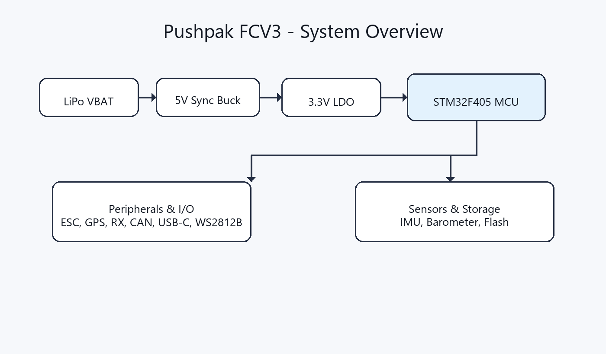
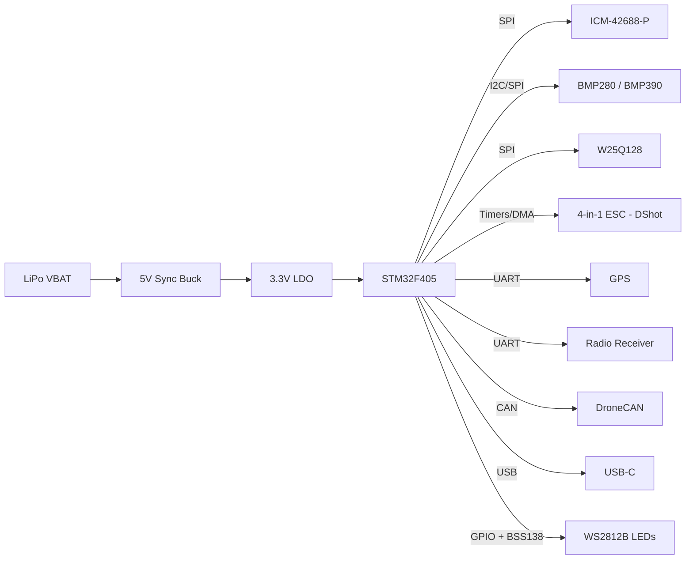

# Pushpak Flight Controller (FCV3)

[Download PCB ZIP](https://github.com/iamneerajverma001/FLIGHT-CONTROLLER-PUSHPAK--2026/archive/refs/heads/main.zip) · One-click download
[Open Portfolio App](https://codesandbox.io/p/sandbox/flight-controller-pushpak-2026-cv6gnv) · One-click live demo

Quick links: [Visuals](#visuals) | [System overview](#system-overview) | [Core specs](#core-hardware-specifications) | [Block diagram](#block-diagram) | [Manufacturing](#manufacturing) | [Architecture](#architecture-deep-dive)

Pushpak FCV3 is a 36x36mm, 4-layer, noise-optimized flight controller built for high-performance FPV and autonomous payload delivery.

## Visuals
| Top view | Bottom view |
| --- | --- |
|  |  |

## System overview

## Key assets
| Asset | Location |
| --- | --- |
| KiCad project | [hardware/FCV3 project.kicad_pro](hardware/FCV3%20project.kicad_pro) |
| Architecture deep dive | [docs/HARDWARE_ARCHITECTURE.md](docs/HARDWARE_ARCHITECTURE.md) |
| System overview graphic | [docs/system_overview.png](docs/system_overview.png) |
| 3D model (VRML) | [outputs/FCV3 project.wrl](outputs/FCV3%20project.wrl) |
| Portfolio web app | [docs/PORTFOLIO_APP.md](docs/PORTFOLIO_APP.md) |

## 3D model
- Board model (VRML): [outputs/FCV3 project.wrl](outputs/FCV3%20project.wrl)

## Block diagram

## Core hardware specifications
- Processor: STM32F405RGT6 (ARM Cortex-M4) for high-speed calculation.
- IMU (Gyro): ICM-42688-P running on a dedicated ultra-fast SPI bus.
- Barometer: BMP280 / BMP390 for altitude hold.
- Blackbox: W25Q128 (16MB Flash) for flight data logging.
- Power delivery: High-efficiency 5V synchronous buck converter (MP1584 / TPS54202) taking raw LiPo voltage, paired with a clean 3.3V LDO for logic.

## Connectivity & I/O
- Motor control: 4-in-1 ESC connector (J21) with full hardware timer and DMA support for zero-latency DShot600.
- Expansions: DroneCAN telemetry, dedicated GPS port, and Radio Receiver port.
- Extras: WS2812B LED output (via BSS138 5V logic shifter) and USB-C for configuration.

## Repository navigation & usage
- hardware/ - KiCad project, schematic, PCB, and library tables.
- libraries/ - Custom symbols, footprints, and 3D models.
- outputs/ - BOM, reports, and manufacturing/export files.
- images/ - Board renders and screenshots.
- docs/ - Deep-dive design notes.

## How to open
1. Clone the repository.
2. Open [hardware/FCV3 project.kicad_pro](hardware/FCV3%20project.kicad_pro) in KiCad 8.0.

## Outputs
- BOM: [outputs/FCV3 project.csv](outputs/FCV3%20project.csv)
- ERC report: [outputs/ERC.rpt](outputs/ERC.rpt)
- Design report: [outputs/report.txt](outputs/report.txt)

## Manufacturing
Fabrication exports (Gerbers and Pick & Place/CPL) can be generated into outputs/ when you are ready to manufacture.

## Architecture deep dive
See the design intent and layout strategy in [docs/HARDWARE_ARCHITECTURE.md](docs/HARDWARE_ARCHITECTURE.md).

## Pinout quick view
For the full pinout tables, see [docs/HARDWARE_ARCHITECTURE.md](docs/HARDWARE_ARCHITECTURE.md).

### Core sensors and buses
| Feature | MCU Pin | Bus | Component |
| --- | --- | --- | --- |
| Gyro CS | PA4 | SPI1 | ICM-42688-P |
| Gyro SCK | PA5 | SPI1 | ICM-42688-P |
| Gyro MISO | PA6 | SPI1 | ICM-42688-P |
| Gyro MOSI | PA7 | SPI1 | ICM-42688-P |
| Flash CS | PA15 | SPI3 | W25Q128 |
| Flash SCK | PC10 | SPI3 | W25Q128 |
| Flash MISO | PC11 | SPI3 | W25Q128 |
| Flash MOSI | PC12 | SPI3 | W25Q128 |
| Baro SCL | PA8 | I2C3 | BMP280 / BMP390 |
| Baro SDA | PC9 | I2C3 | BMP280 / BMP390 |

### Motor and payload outputs
| Output | MCU Pin | Timer | Connection |
| --- | --- | --- | --- |
| Motor 1 | PB3 | TIM2_CH2 | J21 ESC port |
| Motor 2 | PB10 | TIM2_CH3 | J21 ESC port |
| Motor 3 | PB2 | TIM2_CH4 | J21 ESC port |
| Motor 4 | PB4 | TIM3_CH1 | J21 ESC port |
| Motor 5 | PB0 | TIM3_CH3 | Expansion |
| Motor 6 | PB14 | TIM12_CH1 | Expansion |
| Servo 1 | PB15 | TIM12_CH2 | Payload / gimbal |

## Challenges & learnings
- Stackup discipline and clean partitioning were critical to keeping gyro noise low.
- Layout geometry matters as much as routing for flight stability.
- Tight power loops and ground shielding reduced EMI from the buck stage.

## License
Project files are licensed under [LICENSE](LICENSE).
Library components are provided under the terms in [license.txt](license.txt).
