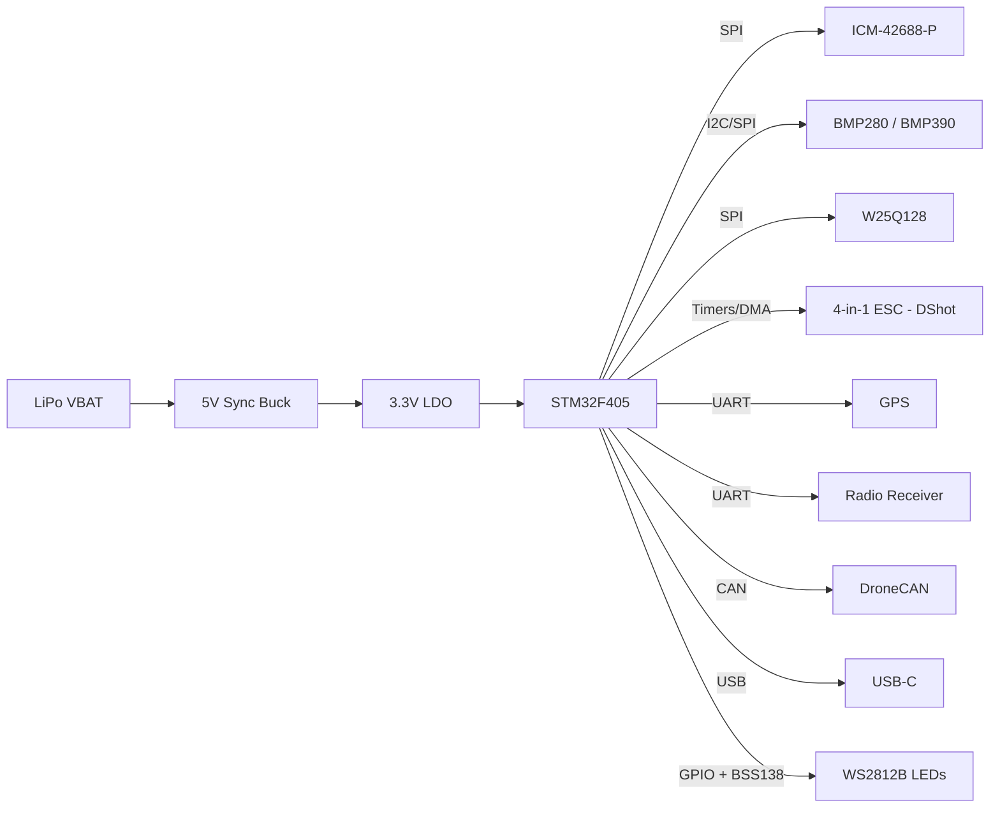

# Hardware Architecture

This document focuses on the design intent behind the layout, stackup, and signal integrity choices.

## Visual references
- Renders: ../images/FCV3 project.png (top), ../images/FCV3 projectBACK.png (bottom).
- 3D model: ../outputs/FCV3 project.wrl.
- System overview: system_overview.png.

## Design goals
- Keep sensor noise low while maintaining fast control loop response.
- Maintain short, direct high-speed routes for the gyro and flash.
- Isolate power switching energy from sensitive analog rails.

## Block diagram

## Master MCU pinout mapping (STM32F4 series)

### Core sensors (internal buses)
| Feature | MCU Pin | Bus / Timer | Component / Function |
| --- | --- | --- | --- |
| Gyro CS | PA4 | SPI1 | ICM-42688-P chip select |
| Gyro SCK | PA5 | SPI1 | ICM-42688-P clock |
| Gyro MISO | PA6 | SPI1 | ICM-42688-P data out |
| Gyro MOSI | PA7 | SPI1 | ICM-42688-P data in |
| Flash CS | PA15 | SPI3 | W25Q128 blackbox chip select |
| Flash SCK | PC10 | SPI3 | W25Q128 blackbox clock |
| Flash MISO | PC11 | SPI3 | W25Q128 blackbox data out |
| Flash MOSI | PC12 | SPI3 | W25Q128 blackbox data in |
| Baro SCL | PA8 | I2C3 | BMP280 / BMP390 clock |
| Baro SDA | PC9 | I2C3 | BMP280 / BMP390 data |

### Propulsion and actuation (DShot and PWM)
| Feature | MCU Pin | Hardware Timer | Physical Connection |
| --- | --- | --- | --- |
| Motor 1 | PB3 | TIM2_CH2 | J21 (4-in-1 ESC port) |
| Motor 2 | PB10 | TIM2_CH3 | J21 (4-in-1 ESC port) |
| Motor 3 | PB2 | TIM2_CH4 | J21 (4-in-1 ESC port) |
| Motor 4 | PB4 | TIM3_CH1 | J21 (4-in-1 ESC port) |
| Motor 5 | PB0 | TIM3_CH3 | Expansion / standalone ESC |
| Motor 6 | PB14 | TIM12_CH1 | Expansion / standalone ESC |
| Servo 1 | PB15 | TIM12_CH2 | Payload drop / camera gimbal |

### Serial connectivity (UART and I2C)
| Feature | MCU Pin | Protocol | Dedicated Function |
| --- | --- | --- | --- |
| GPS TX | PA0 | UART4 | M10/M9 GPS module RX |
| GPS RX | PA1 | UART4 | M10/M9 GPS module TX |
| Radio TX | PA9 | USART1 | ELRS / Crossfire RX |
| Radio RX | PA10 | USART1 | ELRS / Crossfire TX / SBUS |
| ESC RX | PC7 | USART6 | ESC digital telemetry (J21) |
| Ext SCL | PB6 | I2C1 | External compass clock (pulled up) |
| Ext SDA | PB7 | I2C1 | External compass data (pulled up) |
| CAN RX | PB12 | CAN2 | DroneCAN expansion |
| CAN TX | PB13 | CAN2 | DroneCAN expansion |

### Analog inputs (ADC) and lighting
| Feature | MCU Pin | Filter Type | Physical Connection |
| --- | --- | --- | --- |
| Current sensor | PC0 | RC low-pass | ADC1_IN0 (J21 ESC port) |
| Voltage / RSSI | PC5 | RC low-pass | ADC2_IN / VBAT sense |
| Status LED | PB5 | 5V logic shifter | WS2812B data in |

### System and debug
| Feature | MCU Pin | Function | Physical Connection |
| --- | --- | --- | --- |
| USB D- | PA11 | USB-FS | USB-C connector |
| USB D+ | PA12 | USB-FS | USB-C connector |
| SWDIO | PA13 | SWD debug | J11 debug pads |
| SWCLK | PA14 | SWD debug | J11 debug pads |
| OSC IN | PH0 | 8MHz HSE | External crystal |
| OSC OUT | PH1 | 8MHz HSE | External crystal |

## Peripheral mapping and I/O connectivity

### Propulsion and ESC integration (J21 connector)
- Motor outputs (M1 - M4) are mapped to hardware timers (TIM2/TIM3) with DMA support for DShot600 and bidirectional DShot.
- Current sensor input is routed through a dedicated RC low-pass filter before the STM32 ADC.
- VBAT enters the bottom-layer power plant for 5V regulation.

### Radio and telemetry (digital standard)
- Radio receiver port (USART1) is optimized for ELRS, Crossfire, and SBUS. Analog RSSI pads are intentionally omitted.
- ESC telemetry (USART6) provides digital RPM, temperature, and error data from modern ESCs.

### Autonomous navigation (GPS and compass)
- GPS interface (UART4) is dedicated to M10/M8/M9 modules.
- External magnetometer (I2C1) is exposed with onboard 4.7k pull-ups.

### Payload and actuation expansions
- WS2812B LED data is driven through a BSS138 level shifter for reliable 5V signaling.
- Servo and payload PWM pads use hardware timers (TIM12) for deterministic control.

### Configuration and debugging
- USB-C provides high-reliability USB-FS for configuration and logging.
- Bootloader access is supported by a physical BOOT0 button tied to 3.3V.
- SWDIO and SWCLK pads enable bare-metal debugging and firmware bring-up.

## PCB stackup strategy (4-layer strict standard)
- Layer 1 (Top / F.Cu) - The Quiet Zone. This layer hosts the MCU, sensors, and the highest-speed data traces only.
- Layer 2 (Inner 1) - The Shield. A solid GND plane that shields the sensitive top layer from bottom-layer noise.
- Layer 3 (Inner 2) - Power Routing. Dedicated 3V3 and 5V copper polygons for low-impedance delivery.
- Layer 4 (Bottom / B.Cu) - The Power & Noise Zone. High-current VBAT routing and the buck converter stay here.

## Component placement & layout logic
- Gyro positioning: The ICM-42688-P is placed at the geometric center of the 36x36mm board for balanced flight physics.
- MCU orientation: The STM32 is rotated so its SPI1 pins face the gyro, keeping critical traces short and straight.
- Power supply isolation: The 5V buck converter, inductor, and diode are clustered in a single bottom-layer corner to confine magnetic noise.
- Thermal management: The barometer sits in the corner opposite the power supply to reduce heat-induced altitude drift.

## Signal integrity & noise immunity
- Analog low-pass filtering: Ferrite bead + multi-cap decoupling on VDDA and current sensor lines scrub ESC noise before the ADC.
- Decoupling strategy: All 0.1uF caps are placed directly under MCU pins and via'd straight down to minimize loop inductance.
- Logic level shifting: A BSS138 N-channel MOSFET shifts 3.3V MCU GPIO to 5V WS2812B logic to prevent flicker.

## Challenges & learnings
- Balanced mechanical layout improves IMU accuracy and reduces tuning noise.
- Short, direct SPI routes reduce overshoot and make gyro sampling more reliable.
- Power partitioning and a solid GND shield reduce ESC noise coupling into the analog domain.
